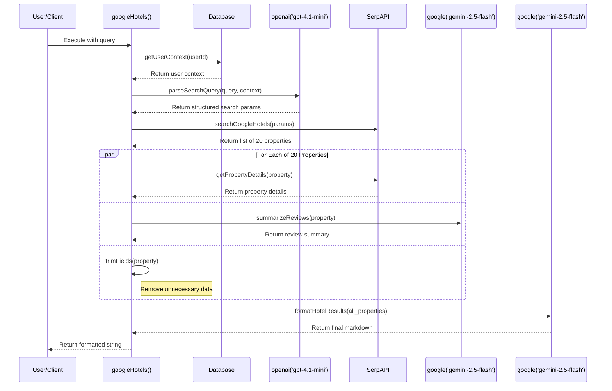

# Google Hotels Tool: Streaming UX Improvement Plan

## ⚠️ CRITICAL CONSTRAINTS - DO NOT VIOLATE

**ONLY 5 FILES MAY BE TOUCHED:**
1. `lib/ai/tools/google-hotels.ts` (or new version + backup)
2. `lib/ai/tools/tool-list.ts` (if necessary)
3. `components/hotel.tsx` (new component)
4. `components/message.tsx` (minimal addition)
5. `docs/hotel-tool-streaming-plan.md`

**ABSOLUTELY FORBIDDEN:**
- Reading, editing, or touching ANY other files other than the 5 explicitly listed
- Even if you see code that might "break the deployment" or literally endanger human life - IGNORE IT if not in one of the 5 whitelisted files
- No exceptions, no "just one more file", no "quick fixes", no "handling a linter error", etc

**PERMITTED FILES TO READ ONLY:**
- Other tool components (like `weather.tsx`)
- Other tools (like `get-weather.ts`)
- The n8n JSON workflow file `hotel_tool_workflow.json`
- The original `google-hotel.ts` file
- Directly related files for understanding patterns

---

## Current State Analysis (CORRECTED - ACTUAL IMPLEMENTATION)

After reading the ACTUAL `google-hotels.ts` file, I found:

### Your Actual Implementation
- **Scale**: Processes **20 hotels** via `limitedProperties = searchResults.properties.slice(0, 20)`
- **Architecture**: **Direct TypeScript implementation** - NO n8n workflow calls
- **Models**: Uses `gpt-4.1-mini` for query parsing, `gemini-2.5-flash` for review summaries and final formatting
- **API Calls**: Direct SerpAPI HTTP requests in TypeScript

### Actual Google Hotels Tool Flow (TypeScript)
1. **Step 1**: Get user context from database (`getUserContext`)
2. **Step 2**: Parse query with `gpt-4.1-mini` (`parseSearchQuery`) 
3. **Step 3**: Direct SerpAPI call for hotel list (`searchGoogleHotels`)
4. **Step 4**: Limit to 20 properties (`slice(0, 20)`)
5. **Step 5**: For each of the 20 properties:
   - Direct SerpAPI call for property details (`getPropertyDetails`)
   - LLM call with `gemini-2.5-flash` to summarize reviews (`summarizeReviews`)
   - Trim unnecessary fields (`trimFields`)
6. **Step 6**: Format final markdown with `gemini-2.5-flash` (`formatHotelResults`)

### The Real Problem
**Current State**: User sees nothing for 5-15+ seconds while the system:
- Makes 1 SerpAPI call for hotel list
- Makes up to 20 additional SerpAPI calls for property details
- Makes up to 20 LLM calls for review summaries
- Makes 1 final LLM call for formatting
- **Total: Up to 42 API calls** (1 + 20 + 20 + 1)

**This needs progress feedback** especially for popular destinations with many properties.

## Solution: Add Streaming Progress to Your Current Tool

**Approach**: Modify ONLY the existing `googleHotels` tool to emit progress updates during the multiple API calls.

### Streaming Strategy

Add progress tracking to show:
1. "Getting your hotel preferences..." (database lookup)
2. "Parsing your search request..." (LLM call)
3. "Searching hotels in [destination]..." (initial SerpAPI call)
4. "Reviewing hotel details... (3/20)" (property details calls)
5. "Analyzing reviews... (7/20)" (review summary calls)
6. "Applying hotel preferences and re-ranking..." (final LLM call)

## DETAILED IMPLEMENTATION CHECKLIST

**⚠️ CRITICAL: This implementation will NOT touch `route.ts` or any main application files. Only tool files and UI components.**

### ✅ **STEP ZERO: Version Control & Safety (CRITICAL - DO FIRST)**
- [ ] **Commit current state to GitHub**
  - [ ] Run: `git add . && git commit -m "Pre-hotel-streaming: backup current state" && git push`
- [ ] **Create feature branch**
  - [ ] Run: `git checkout -b feature/hotel-streaming-progress`
- [ ] **Backup the file we'll modify**
  - [ ] Run: `cp lib/ai/tools/google-hotels.ts lib/ai/tools/google-hotels.ts.backup`
- [ ] **Verify backup exists**
  - [ ] Confirm `lib/ai/tools/google-hotels.ts.backup` was created successfully

### ✅ **Phase 1: Modify Existing Google Hotels Tool (ONLY)**
- [ ] **File: `lib/ai/tools/google-hotels.ts`**
  - [ ] Add progress updates during each major step:
    - [ ] After database lookup: "Getting your hotel preferences..."
    - [ ] After query parsing: "Parsing your search request..."
    - [ ] After initial search: "Searching hotels in [destination]..."
    - [ ] During property details loop: "Reviewing hotel details... (X/20)"
    - [ ] During review summary loop: "Analyzing reviews... (X/20)"
    - [ ] Before final formatting: "Applying hotel preferences and finalizing recommendations..."
  - [ ] Test that existing functionality still works 100% with 20 hotel processing
  - [ ] Verify no breaking changes to tool return value

### ✅ **Phase 2: Create Hotel Progress Component (NEW FILE)**
- [ ] **File: `components/hotel.tsx`**
  - [ ] Create React component to display hotel search progress
  - [ ] Handle progress states: preferences, parsing, searching, details (with count), reviews (with count), formatting
  - [ ] Include progress bar for details and review phases (X/20)
  - [ ] Add realistic time estimates ("This may take 5-15 seconds...")
  - [ ] Use your existing UI patterns (shadcn/ui components)
  - [ ] Add spinning loader animation
  - [ ] Test component renders correctly

### ✅ **Phase 3: Update Message Display (MINIMAL ADDITION)**
- [ ] **File: `components/message.tsx`**
  - [ ] Add ONE case for `toolName === 'googleHotels'` following existing pattern
  - [ ] Show progress component during tool call state
  - [ ] Show final results after completion
  - [ ] Test with existing message display logic

### ✅ **Phase 4: Test & Verify (20 Hotel Scale)**
- [ ] **Functionality Test**
  - [ ] Test hotel search in major cities (NYC, Tokyo, London)
  - [ ] Verify all 20 hotels are still processed correctly
  - [ ] Confirm progress updates appear during 5-15 second execution
  - [ ] Verify final markdown results are identical to current version
- [ ] **Performance Test**
  - [ ] Test with different destination types (cities, regions, countries)
  - [ ] Verify progress updates don't slow down the SerpAPI calls
  - [ ] Test error handling if SerpAPI calls fail

### ✅ **Phase 5: Commit & Deploy**
- [ ] **Git Commit**
  - [ ] Run: `git add . && git commit -m "Add streaming progress to Google Hotels tool (10 hotel scale)" && git push`
- [ ] **Create Pull Request**
  - [ ] Test on staging with real hotel searches
  - [ ] Merge feature branch back to main after testing
- [ ] **Deploy to Vercel**
  - [ ] Verify deployment successful
  - [ ] Test live functionality with major cities

## Success Criteria
1. **20 hotel processing** remains exactly the same
2. Users see meaningful progress during the 5-15 second execution
3. Progress updates show realistic hotel processing counts (X/20)
4. No breaking changes to existing direct SerpAPI implementation
5. Final results remain identical in quality and detail

## Why This Matters
Processing 20 hotels with direct SerpAPI calls and comprehensive review analysis requires multiple API calls that can take 5-15+ seconds. The streaming progress will make this operation feel much more responsive to users.

---

## Appendix: Analysis of `getWeather` Tool (Client-Side UI Pattern)

This section analyzes the existing implementation of the `getWeather` tool to serve as a reference for the Vercel AI SDK's client-side generative UI pattern. This is the pattern we will adapt for the `googleHotels` tool.

### 1. `lib/ai/tools/get-weather.ts`
- **Definition**: This file defines a standard tool using `import { tool } from 'ai'`.
- **Functionality**: Its `execute` function makes a single API call to `api.open-meteo.com` to fetch weather data.
- **Return Value**: It returns the entire JSON payload from the weather API. It does **not** stream partial data or UI components from the server.

### 2. `components/weather.tsx`
- **Role**: This is a client-side React component responsible for displaying the weather.
- **Dual State**: The component is designed to render in two states:
    1.  **Skeleton/Loading State**: If the `weatherAtLocation` prop is `undefined`, the component renders a placeholder UI using hardcoded `SAMPLE` data and applies `skeleton-bg` and `skeleton-div` CSS classes. This provides an immediate visual feedback that the tool is running.
    2.  **Result State**: When the `weatherAtLocation` prop is provided with the actual data from the tool, the component renders the live weather information.

### 3. `components/message.tsx`
- **Orchestration**: This component orchestrates which state of the `<Weather />` component to show. It inspects the `tool-invocation` parts of the AI message stream.
- **`state: 'call'`**: When a tool part with `state: 'call'` for `toolName: 'getWeather'` is received, `message.tsx` renders the `<Weather />` component *without* any props. This triggers the component's internal skeleton state.
- **`state: 'result'`**: When a subsequent tool part with `state: 'result'` arrives, `message.tsx` re-renders the `<Weather />` component, but this time it passes the API payload via the `weatherAtLocation={result}` prop. This displays the final, data-filled UI.

This client-side rendering pattern is effective for simple tools with a clear "loading" and "finished" state. The server sends data, and the client decides how to render it. For the more complex, multi-step `googleHotels` tool, we will extend this pattern by sending custom progress events in the data stream that the client can use to render more detailed, intermediate loading states.

---

## Appendix B: Correct Implementation Strategy (Vercel Official Guidance)

Based on a thorough review of the official Vercel AI SDK documentation, including the [Chatbot Tool Usage guide](https://ai-sdk.dev/docs/ai-sdk-ui/chatbot-tool-usage), the [RSC to UI migration guide](https://ai-sdk.dev/docs/ai-sdk-rsc/migrating-to-ui), and the [`vercel/ai`](https://github.com/vercel/ai) library examples, the following is the correct, production-ready approach. The previous considerations of using `streamUI` or other RSC-based patterns are incorrect as that package is experimental and **not recommended for production use**.

### Core Architecture
The architecture must be separated into two primary concerns:

1.  **Backend (API Route):** A standard Next.js API route (e.g., `app/api/chat/route.ts`) will be responsible for handling the logic. It will use the `streamText` function from the `ai` package to interact with the LLM and define the tools the model can call.
2.  **Frontend (Client Component):** A client component (e.g., `components/message.tsx` or a dedicated chat component) will use the `useChat` hook from `@ai-sdk/react` to manage the chat state, send user messages to the API route, and render the conversation.

### How Tool UI Rendering Works
This pattern does not stream React components directly from the server. Instead, it streams structured data about the tool's execution, which the client then uses to render the appropriate UI.

1.  **Tool Definition (`/api/chat/route.ts`):** The `googleHotels` tool will be defined within the `tools` object of the `streamText` call. Its `execute` function will perform the necessary work (API calls, data processing) and return a final JSON object with the results.
2.  **Tool Call (`useChat`):** When the model decides to use the `googleHotels` tool, the `useChat` hook will receive a message part of type `tool-invocation`.
3.  **Loading State (`components/message.tsx`):** The client will inspect this `tool-invocation` part. While `part.toolInvocation.state` is `'call'`, the client will render a loading component (e.g., a new `<HotelSkeleton />` component). This shows the user that the tool is in progress.
4.  **Result State (`components/message.tsx`):** Once the tool's `execute` function on the server completes, `streamText` sends down the final result. The `useChat` hook receives another `tool-invocation` part where `part.toolInvocation.state` is now `'result'`. The client will then render the final UI component (e.g., `<HotelResults />`), passing the `part.toolInvocation.result` as props.

This approach is robust, stable, and aligns with Vercel's official best practices for building generative UI with their SDK.

---

## Appendix C: Detailed Analysis of `google-hotels.ts`

This section provides a complete, step-by-step breakdown of the `google-hotels.ts` tool's execution flow, confirming a full reading of the file.

### Execution Sequence Diagram

### Detailed Code Walkthrough

The file exports a single primary function, `googleHotels`, created using the `tool` helper from the Vercel AI SDK on **line 547**. Its `execute` function, starting on **line 550**, orchestrates the entire process.

Here is the step-by-step execution flow:

1.  **Get User Context (Lines 592-593):** It first calls `getUserContext` to fetch the user's saved preferences (`context_hotels`) from the `userProfiles` table in the database. This is the first `await`.

2.  **Parse the Query (Lines 596-597):** It then calls `parseSearchQuery`. This function constructs a detailed prompt that includes the user's query, the context from the database, and the current date. It uses `generateObject` with the `openai('gpt-4.1-mini')` model (**line 105**) to parse the natural language query into a structured JSON object conforming to `searchQuerySchema`.

3.  **Initial Hotel Search (Lines 600-601):** The parsed parameters are passed to `searchGoogleHotels`. This function builds a URL for the SerpAPI "google_hotels" engine.
    *   It contains specific hardcoded logic: `rating: '8'` (**line 144**).
    *   It has a critical conditional check on `vacation_rentals` (**lines 148-156**). If `true`, it uses vacation rental `property_types`; otherwise, it uses hotel `property_types` and sets `hotel_class` to '3,4,5'.
    *   This function makes the first of many `fetch` calls to SerpAPI.

4.  **Process 20 Properties Concurrently (Lines 614-633):**
    *   The tool intentionally limits the results to the first 20 hotels using `.slice(0, 20)` on **line 615**.
    *   It then uses `Promise.all` to process these 20 properties in parallel. For each property, it executes a pipeline of three asynchronous functions: `getPropertyDetails`, `summarizeReviews`, and `trimFields`.
    *   Inside this loop, on **line 618**, is the console log: `console.log(\`[GoogleHotels] Processing property ${index + 1}/${limitedProperties.length}: ${property.name}\`);`.

5.  **Inner Pipeline Functions:**
    *   **`getPropertyDetails`**: Makes a second `fetch` call to SerpAPI for each property, using the `serpapi_property_details_link`. If this call fails, it returns `null` (**line 247**) instead of throwing an error, preventing the entire `Promise.all` from failing.
    *   **`summarizeReviews`**: Takes the review data and uses `generateText` with the `google('gemini-2.5-flash')` model (**line 410**) to create a concise summary.
    *   **`trimFields`**: This is a synchronous function that runs last. It removes dozens of deeply nested, unnecessary fields from the final object to reduce its size, such as `details.amenities_groups`, `about.options`, and `reviews_breakdown.rating_visualizations`.

6.  **Final Formatting (Lines 636-637):** After `Promise.all` resolves, the processed list of hotel objects is passed to `formatHotelResults`. This function uses another `generateText` call, also with `google('gemini-2.5-flash')` (**line 538**), to convert the structured JSON data into the final, user-facing markdown format.

7.  **Log and Return (Lines 640-650):** Finally, it logs the estimated token count of the result, logs that execution is finished, and returns the final markdown string. The `catch` block on **line 653** handles any errors that might have occurred during the process.
